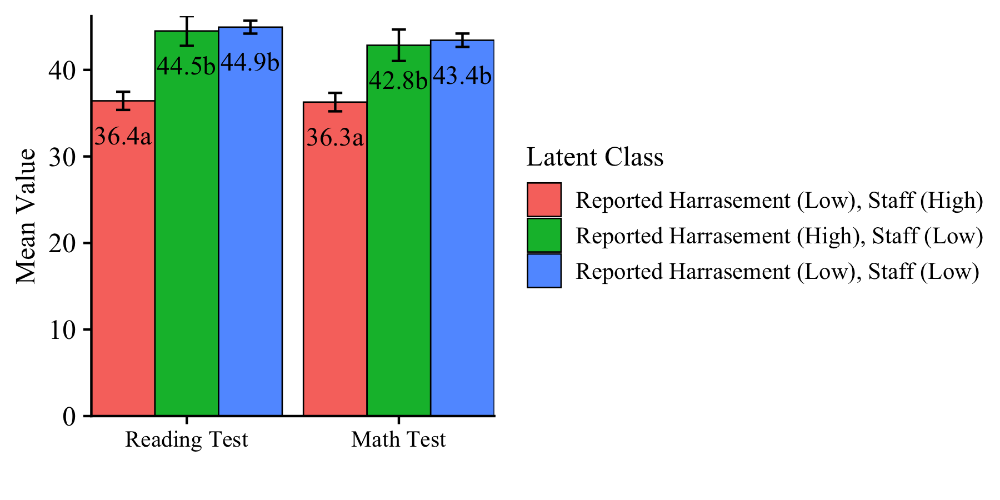
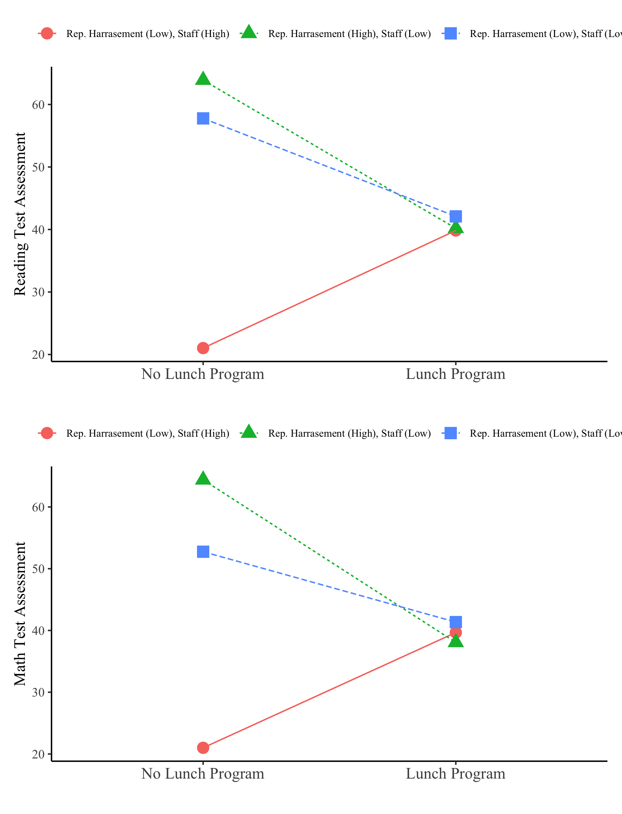

## Video tutorial repository: "3-Step-ML-auto"

- - -

### 3-Step ML Auxiliary Variable Integration Using `MplusAutomation`

#### *Adding Covariate and Distal Outcome Variables to Mixture Models*

#### IMMERSE Project: Adam Garber

- - -


The Institute of Mixture Modeling for Equity-Oriented Researchers, Scholars, and Educators (`IMMERSE`) is an IES funded training grant (R305B220021) to support education scholars in integrating mixture modeling into their research.

Visit our [Website](https://immerse.education.ucsb.edu/) to learn more about the IMMERSE project.

Follow us on [Twitter](https://twitter.com/IMMERSE_UCSB) for updates on posted resources!

Visit our [GitHub](https://github.com/immerse-ucsb/) account to follow along with this tutorial & others. 

- - -

## What is included in this video tutorial?

> This `R` tutorial automates the 3-step ML auxiliary variable procedure using the `MplusAutomation` package (Hallquist & Wiley, 2018) to estimate models and extract relevant parameters. To learn more about auxiliary variable integration methods and why multi-step methods are necessary for producing un-biased estimates see Asparouhov & Muthén (2014). 

> The motivation for this tutorial is that conducting the 3-step manually is highly error prone as it requires pulling logit values estimated in the step-1 model and adding them in the model statement of the step-2 model (i.e., lots of copying & pasting). In contrast, this approach is fully replicable and provides clear documentation which translates to more reliable research. Also, it saves time!

\newpage

- - -

**How to reference this tutorial:**

Garber, A. C. (2021). 3-Step ML Auxiliary Variable Integration Using MplusAutomation. Retrieved from [psyarxiv.com/phtxa](https://psyarxiv.com/phtxa)

- - -

**Follow along! Link to `Github` repository:**

https://github.com/immerse-ucsb/3step-ML-auto

- - -

Load packages
```{r}
library(MplusAutomation) # Conduit between R & Mplus
library(glue)            # Pasting R code into strings
library(here)            # Location, location, location
library(tidyverse)       # Tidyness
library(gt)              # Tables
```

- - -

### Data Source: Civil Rights Data Collection (CRDC)

> The CRDC is a federally mandated school and district level data collection effort that occurs every other year. This public data is currently available for selected variables across 4 years (2011, 2013, 2015, 2017) and all US states. In the following tutorial six focal variables are utilized as indicators of the latent class model; three variables which report on harassment/bullying in schools based on disability, race, or sex, and three variables on full-time equivalent school staff employees (counselor, psychologist, law enforcement). For this example, we utilize a sample of schools from the state of Arizona reported in 2017.

**Information about CRCD:** https://www2.ed.gov/about/offices/list/ocr/data.html

**Data access (`R`):** https://github.com/UrbanInstitute/education-data-package-r


- - -

Read in CSV data file from the `data` subfolder
```{r}

data_3step <- read_csv(here("data", "crdc_aux_data.csv"))

```


\newpage

- - -

## "Manual 3-Step" ML Auxiliary Variable Integration Method

- - -


### Step 1 - Estimate the unconditional model with all covariate & distal outcome variables mentioned in the `auxiliary` statement.

**NOTE**: In this example, Mplus input and output files are directed to the sub-folder `3step_mplus`. Due to the fact that adding auxiliary variables is conducted after enumeration, generally other sub-folders will exist in the top-most `Rproject` folder such as `enum_mplus`, `data`, and `figures`.

```{r}

m_step1  <- mplusObject(
  TITLE = "Step1  (MANUAL 3-STEP ML APPROACH)", 
  VARIABLE = 
   "categorical = report_dis report_race report_sex counselors_fte psych_fte law_fte; 
   
    usevar = report_dis report_race report_sex counselors_fte psych_fte law_fte;
    
    classes = c(3); 
    
    !!! All auxiliary variables to be considered in the final model should be listed here !!!
    auxiliary = 
    lunch_program read_test math_test;",
  
  ANALYSIS = 
   "estimator = mlr; 
    type = mixture; 
    starts = 500 100;
  
    !!! to replicate class order use, `optseed = 887580;` !!!",
  
  SAVEDATA = 
   "!!! This saved dataset will contain class probabilities and modal assignment columns !!!
    File=3step_savedata.dat;
    Save=cprob;
    Missflag= 999;",
  
  PLOT = 
    "type = plot3; 
    series = report_dis report_race report_sex counselors_fte psych_fte law_fte(*);",
  
  usevariables = colnames(data_3step),
  rdata = data_3step)

m_step1_fit <- mplusModeler(m_step1,
                 dataout=here("3step_mplus", "Step1_3step.dat"),
                 modelout=here("3step_mplus", "Step1_3step.inp") ,
                 check=TRUE, run = TRUE, hashfilename = FALSE)
```

- - -

### Step 2 - Extract logits & saved data from the step 1 unconditional model.

Extract logits for the classification probabilities for the most likely latent class 
```{r}

logit_cprobs <- as.data.frame(m_step1_fit[["results"]]
                                         [["class_counts"]]
                                         [["logitProbs.mostLikely"]])
```

Extract saved data from the step 1 model `mplusObject` named "m_step1_fit"
```{r}

savedata <- as.data.frame(m_step1_fit[["results"]]
                                     [["savedata"]])
```

Rename the column in savedata for "C" and change to "N"
```{r}

colnames(savedata)[colnames(savedata)=="C"] <- "N"

```

### Step 2 (part 2) - Estimate the unconditional model with logits from step 2. 

This model is estimated to check that the class proportions are approximately the same as in step 1. 
```{r}

m_step2  <- mplusObject(
  TITLE = "Step2  (MANUAL 3-STEP ML APPROACH)", 
  
  VARIABLE = 
 "nominal=N;
  USEVAR = n;
  missing are all (999); 
  classes = c(3); ",
  
  ANALYSIS = 
 "estimator = mlr; 
  type = mixture; 
  starts = 0;",
  
  MODEL = 
    glue(
 "%C#1%
  [n#1@{logit_cprobs[1,1]}];
  [n#2@{logit_cprobs[1,2]}];
  
  %C#2%
  [n#1@{logit_cprobs[2,1]}];
  [n#2@{logit_cprobs[2,2]}];
  
  %C#3%
  [n#1@{logit_cprobs[3,1]}];
  [n#2@{logit_cprobs[3,2]}];"),
 
  usevariables = colnames(savedata), 
  rdata = savedata)

m_step2_fit <- mplusModeler(m_step2, 
                 dataout=here("3step_mplus", "Step2_3step.dat"), 
                 modelout=here("3step_mplus", "Step2_3step.inp"), 
                 check=TRUE, run = TRUE, hashfilename = FALSE)
```

- - -

### Step 3 - Add covariates & distal outcomes to the model. 

##  Estimate the final SEM Model - Moderation Example

- - -

**Specification details:**

- This example contains two distal outcomes (`read_test` & `math_test`) and one binary covariate (`lunch_program`).
- Under each class-specific statement (e.g., `%C#1%`) the distal outcomes are mentioned to estimate the intercept parameters. 
- Moderation is specified by mentioning the `"outcome ON covariate;"` syntax under each of the class-specific statements. 
- Note that the binary covariate is centered so that reported distal means (intercepts) are estimated at the weighted average of `lunch_program`.

```{r}

m_step3  <- mplusObject(
  TITLE = "Step3  (MANUAL 3-STEP ML APPROACH)", 
  
  VARIABLE = 
 "nominal = N;
  usevar = n;
  missing are all (999); 
  
  usevar = lunch_pr read_tes math_tes;
  classes = c(3); ",
 
  DEFINE =
 "Center lunch_pr (Grandmean);",
  
  ANALYSIS = 
 "estimator = mlr; 
  type = mixture; 
  starts = 0;",
  
  MODEL =
  glue(
 "!!! OUTCOMES = read_tes math_tes !!! 
  !!! MODERATOR = lunch_pr !!! 
  
  %OVERALL%
  read_tes on lunch_pr;
  read_tes;
  
  math_tes on lunch_pr;
  math_tes;

  %C#1%
  [n#1@{logit_cprobs[1,1]}];
  [n#2@{logit_cprobs[1,2]}];
  
  [read_tes](m01);
  read_tes;                    !!! estimate conditional intercept !!!
  read_tes on lunch_pr (s01);    !!! estimate conditional regression !!!

  [math_tes] (m1);
  math_tes;
  math_tes on lunch_pr (s1);

  %C#2%
  [n#1@{logit_cprobs[2,1]}];
  [n#2@{logit_cprobs[2,2]}];
  
  [read_tes](m02);
  read_tes;
  read_tes on lunch_pr (s02);

  [math_tes] (m2);
  math_tes;
  math_tes on lunch_pr (s2);
  
  %C#3%
  [n#1@{logit_cprobs[3,1]}];
  [n#2@{logit_cprobs[3,2]}];
  
  [read_tes](m03);
  read_tes;
  read_tes on lunch_pr (s03);

  [math_tes] (m3);
  math_tes;
  math_tes on lunch_pr (s3);"),
  
  MODELCONSTRAINT = 
 "New (diff12 diff13
  diff23 slope12 slope13
  slope23 ndiff12 ndiff13
  ndiff23 nslope12 nslope13
  nslope23);

  diff12 = m1-m2;   ndiff12 = m01-m02;
  diff13 = m1-m3;   ndiff13 = m01-m03;
  diff23 = m2-m3;   ndiff23 = m02-m03;
  slope12 = s1-s2;  nslope12 = s01-s02;
  slope13 = s1-s3;  nslope13 = s01-s03;
  slope23 = s2-s3;  nslope23 = s02-s03;",
  
  MODELTEST =
  ## NOTE: Only a single Wald test can be conducted per model run. Therefore, 
  ## this example requires running separate models for each omnibus test (e.g.,
  ## 4 models; 2 outcomes and 2 slope coefficients). This can be done by
  ## commenting out all but one test and then estimating multiple versions of the model.
   
 "!m01=m02;    !!! Distal outcome omnibus Wald test for `read_tes` !!!
  !m02=m03;

  !s01=s02;   !!! Slope difference omnibus Wald test for `read_tes on lunch_pr` !!!
  !s02=s03;
  
  m1=m2;       !!! Distal outcome omnibus Wald test for `math_tes` !!!
  m2=m3;       

  !s1=s2;      !!! Slope difference omnibus Wald test `math_tes on lunch_pr` !!!
  !s2=s3;


 
 ",
 
  usevariables = colnames(savedata), 
  rdata = savedata)

m_step3_fit <- mplusModeler(m_step3,
                 dataout=here("3step_mplus", "Step3_3step.dat"), 
                 modelout=here("3step_mplus", "Step3_3step.inp"), 
                 check=TRUE, run = TRUE, hashfilename = FALSE)
```

**End of 3-Step Procedure**

- - -

## Visualize results:

> NOTE: The next video in this series will include a detailed tutorial on how to interpret auxiliary variable output (i.e. distal outcomes & covariates) in the context of moderation. This tutorial will also cover `R` code to generate figures for visualizing the results. 

- - -

### Distal outcome mean differences




### Latent class moderates effect of school `Lunch Program` (X) on `Reading` & `Math`assessments (Ys)



- - -

## References

- - -

Asparouhov, T., & Muthén, B. O.
(2014). 
Auxiliary variables in mixture modeling: Three-step approaches using Mplus. 
Structural Equation Modeling, 21, 329–341. http://dx.doi.org/10.1080/10705511.2014.915181

Hallquist, M. N., & Wiley, J. F.
(2018).
MplusAutomation: An R Package for Facilitating Large-Scale Latent Variable Analyses in Mplus.
Structural equation modeling: a multidisciplinary journal, 25(4), 621-638.

Müller, Kirill. 
(2017).
Here: A Simpler Way to Find Your Files. 
https://CRAN.R-project.org/package=here.

Muthén, B. O., Muthén, L. K., & Asparouhov, T.
(2017).
Regression and mediation analysis using Mplus.
Los Angeles, CA: Muthén & Muthén.

Muthén, L.K.
and Muthén, B.O.
(1998-2017).
Mplus User's Guide.
Eighth Edition. Los Angeles, CA: Muthén & Muthén

US Department of Education Office for Civil Rights.
(2014). 
Civil rights data collection data snapshot: School discipline. 
Issue brief no. 1.

R Core Team (2017).
R: A language and environment for statistical computing.
R Foundation for Statistical Computing, Vienna, Austria.
URL <http://www.R-project.org/>

Wickham et al., (2019).
Welcome to the tidyverse.
Journal of Open Source Software, 4(43), 1686, <https://doi.org/10.21105/joss.01686>

- - -

